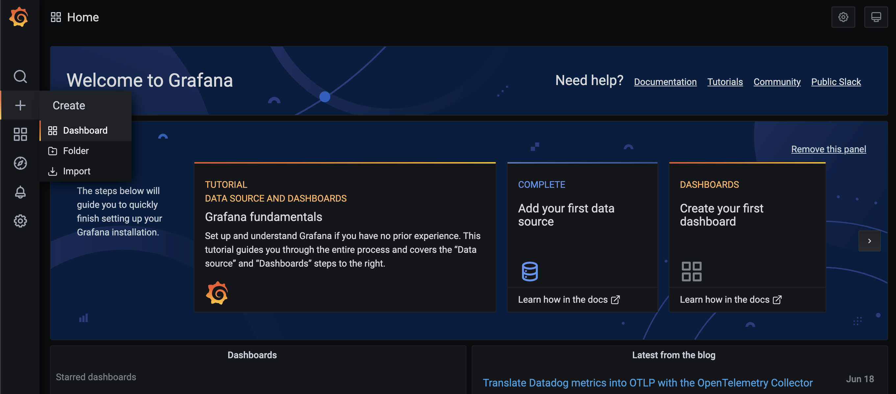
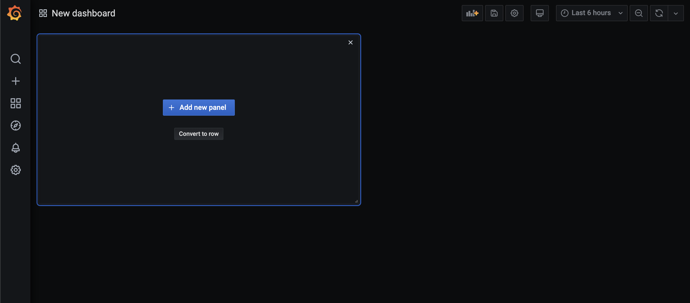
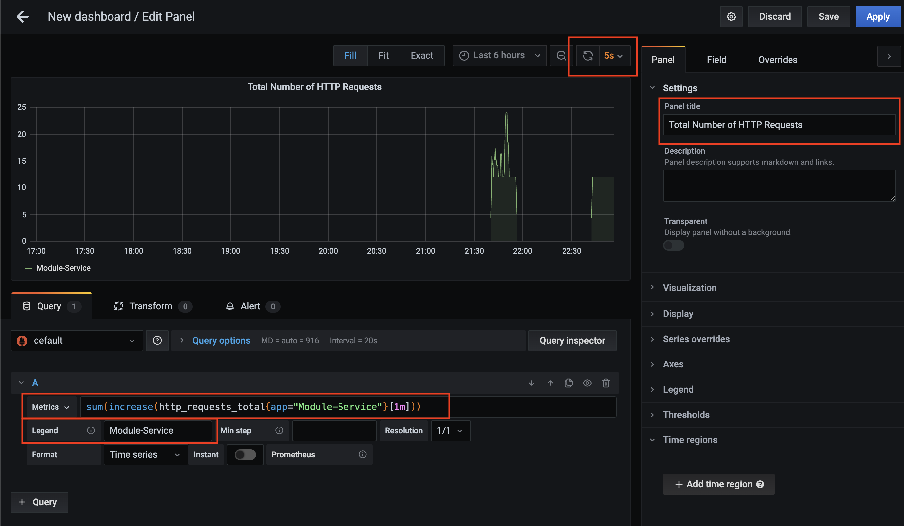
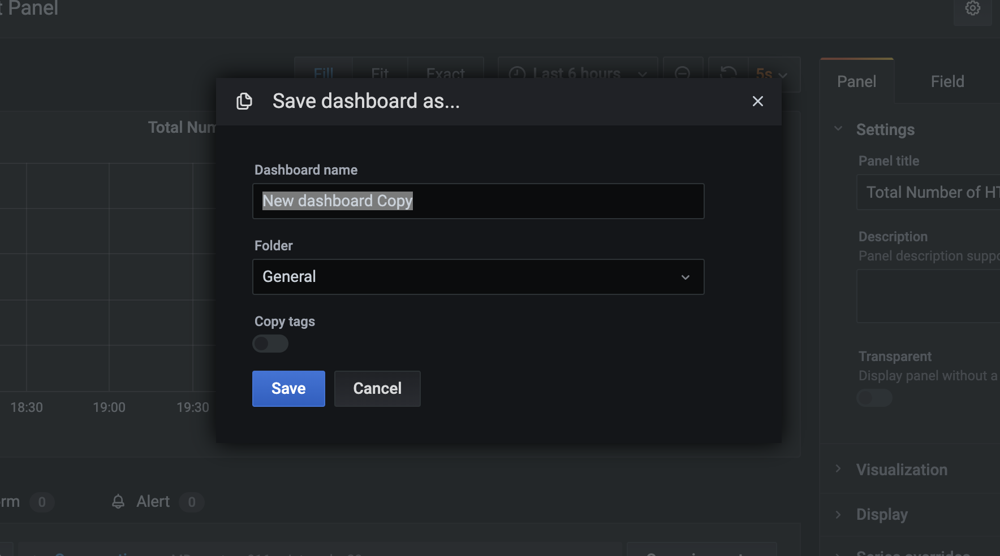
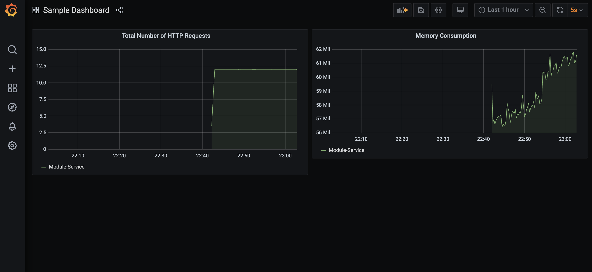

# Module Review System

This project is a microservices-based system for managing module information and reviews. It consists of two separate services:

- **Module Service**: Manages module data.
- **Review Service**: Handles reviews associated with each module.

## Features

- **CRUD Operations**: Both services support create, read, update, and delete operations.
- **Microservice Architecture**: Each service is independently deployable, scalable, and maintainable.
- **Support for Multiple Client Types**: The services can be accessed via the provided React Web App, SwiftUI iOS App and Python CLI App.
- **Interactivity**: Allows users to select modules, view reviews, and submit new reviews.

## Technologies Used

- **Microservices**: Node.js, Express
- **Web App**: React, Axios for API calls
- **iOS App**: SwiftUI
- **CLI App**: Python
- **Containerization**: Docker, Docker Compose
- **Service Monitoring**: Prometheus, Grafana
- **API Gateway**: NGINX

## Project Structure

- `clients/CLI`: Contains all code for the CLI based client.
- `clients/iOS`: Contains all code for the iOS based client.
- `services/api_gateway`: Contains all configurations for the API Gateway (NGINX).
- `services/backend/ModuleService/`: Contains all code for the module service.
- `services/backend/ReviewService/`: Contains all code for the review service.
- `services/frontend/`: Contains all React code for the frontend application.
- `services/docker-compose.yml`: Configuration file to orchestrate the services with Docker Compose.

## Getting Started

### Prerequisites

- Docker
- Docker Compose
- Python (for CLI Client)
- Xcode 15.2+ (for iOS App)

### Installation

1. **Clone the repository**

2. **Ensure Docker is running**

3. Navigate into `services` directory

```bash
cd services
```

4. **Run with Docker Compose**

```bash
docker-compose up --build
```

This command builds the images for the services in the `docker-compose.yml` file and starts the containers.

> :exclamation: The build process may take a while, depending on the network speed and PC specifications.

### Using the Web Application

- Open your web browser to `http://localhost:3005`.
- Select a module from the dropdown to view reviews.
- Submit new reviews using the form that appears after selecting a module.

### Using the CLI Application

- Launch terminal and navigate to `clients/CLI` directory.
- Run the CLI app using the command `python3 client.py`
- Interact with the services using the CLI Interface.

### Using the iOS Application

- Navigate to `clients/iOS` directory.
- Open the `ModReview` folder using Xcode.
- Build and Run the app using the Xcode Run Command.
- Interact with the services using the iOS App.

### Using Monitoring Tools

- Open your web browser to `http://localhost:3003`.
- Create a new Dashboard by clicking on the `+` icon on the left-hand side toolbar.
  

- Click `Add new panel`.
  

- Enter the following PromQL Query:

```bash
sum(increase(http_requests_total{app="Module-Service"}[1m]))
```

The above command allows you to track the number of requests that Module Service is handling every minute.

- Update the panel title to `Total Number of HTTP Requests`.
- Update the legend to `Module-Service`.
- Click on the refresh icon and select the refresh rate to be `5s`.

  

- Click `Save` and enter a Dashboard name, then click on `Save` again.
  

- You can add more panels and move them around and arrange them as you like. A sample is shown below, that tracks the total number of requests handled and memory consumption of Module-Service.
  

### Service Registry

- React Web App: `http://localhost:3005`
- Module Service: `http://localhost:3005/api/module_service`
- Review Service: `http://localhost:3005/api/review_service`
- Prometheus Service: `http://localhost:9090`
- Grafana Service: `http://localhost:3003`

## API Reference

### Module Service

- **GET `/modules`**: Fetch all modules.
- **GET `/modules/:id`**: Fetch a module.
- **POST `/modules`**: Add a new module.
- **PUT `/modules/:id`**: Update an existing module.
- **DELETE `/modules/:id`**: Delete a module.
- **GET `/metrics`**: Fetch metrics for monitoring (used by Prometheus and Grafana).

#### Module Schema:

```JSON
{
    "id": "Unique ID for Module, eg: 1abc2 [String]",
    "code": "Module Code, eg: CS1101S [String]",
    "name": "Module Name, eg: Programming Methodology [String]"
}
```

### Review Service

- **GET `/reviews`**: Fetch all reviews.
- **GET `/reviews/module/:moduleId`**: Fetch all reviews for a module.
- **POST `/reviews`**: Add a new review.
- **PUT `/reviews/:id`**: Update an existing review.
- **DELETE `/reviews/:id`**: Delete a review.

#### Review Schema:

```JSON
  {
    "id": "Unique ID for Review, eg: 2bcd3 [String]",
    "moduleId": "Mapped to Module Id in Module Service, eg: 1abc2 [String]",
    "reviewer": "(Optional) Name of Reviewer, eg: Jonathan [String]",
    "review": "Review, eg: Excellent introduction to programming. [String]",
    "rating": "Rating out of 5, eg: 5 [Int]"
  }
```
